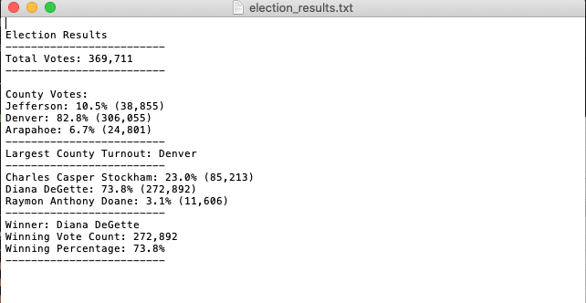

# Election_Analysis

## Overview of Election Audit 
A Colorado Board of Elections employee has given the following tasks to complete the election audit of a recent local congressional election. 

1. Calculate the total number of votes cast. 
2. Get a complete list of candidates who received votes. 
3. Caculate the total number of votes ech candidate received. 
4. Calculate the percentage of votes each candidare won. 
5. Determine the winner of the election based on popular vote. 
6. Calculate the total number of votes per county.
7. Calculate the percentage of votes per county. 
8. Determine the county with the largest number of voters. 
9. Save elections results to a Text File

## Resources 
- Data source: election_results.csv
- Software: Python 3.7.6, Visual Studio Code 1.50.0 
 
 
 ## Election-Audit Results  
 
 The analysis of the election show that: 
 
 - There were 369,711 votes cast in the election.
 - The county votes in the elections were:
  - Jefferson County with 10.5% of voters and 38,855 total votes.
  - Denver County with 82.8% of voters and 306,055 total votes.
  - Arapahoe County with 6.7% of voters and 24,801 total votes.
 - Denver had the largest number of votes. 
  The candidates results were:
  - Charles Casper Stockham received 23.0% of the vote and 85,213 number of votes.
  - Diana DeGette received 73.8% of the vote and 272,892 number of votes.
  - Raymon Anthony Doane received 3.1% of the vote and 11,606 number of votes. 
 The winner of the election was:
  - Candidate Diana DeGette, who received 73.8% of the vote and 272,892 votes.
 
In addition, the image below shows the summary of the Election Results. 

*Fig. 1 - Election Results*
 
 ## Election-Audit Summary 
 
 If the Colorado Board of Elections has another dataset with the same structure; Ballot ID, County & Candidate, this script can be used for any election just by updating the inbound file and outfile file, as ilustratated in the example below. 
 
'# Add a variable to load a file from a path.
file_to_load = os.path.join("Insert the path to the new dataset/new_dataset_name.csv")

'# Add a variable to save the file to a path.
file_to_save = os.path.join("/Insert the path to the new save file", "new_results.txt")
 

  
